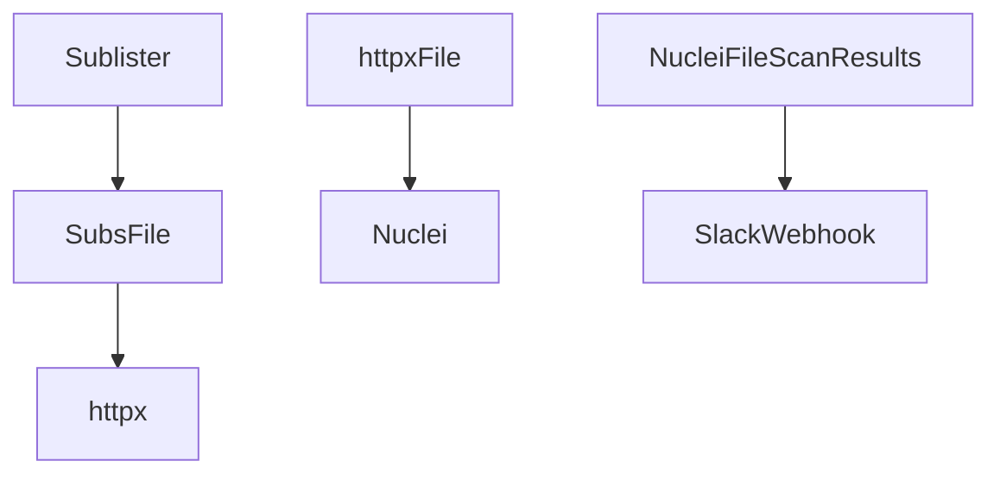
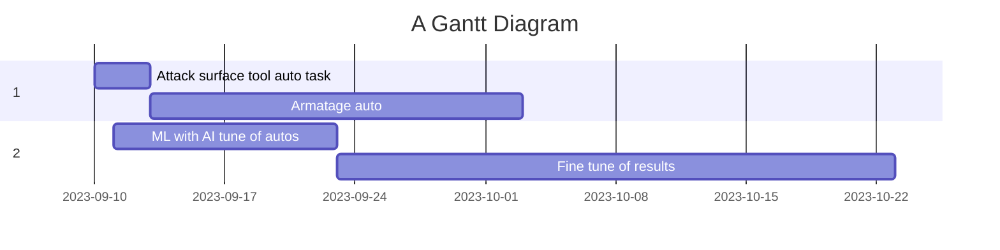

# r.e.d - by Jon Little 

## Open Source - Attack Surface Monitoring

red teaming infra and automations

Used for automated testing appsec tests and reporting.

Only set parameters for what each bounty program allows according to scope these are just examples of how this system can work for your company.

## Disclaimer: I am not responsible for you testing a companies security posture with out permission.

Sponsored by: https://Falconcore.io/news - Free Threat Intelegence feeds curated by security experts.






```
go install -v github.com/projectdiscovery/nuclei/v2/cmd/nuclei@latest
go install -v github.com/projectdiscovery/httpx/cmd/httpx@latest
go install -v github.com/projectdiscovery/subfinder/v2/cmd/subfinder@latest
```
